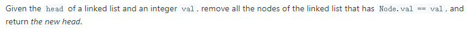
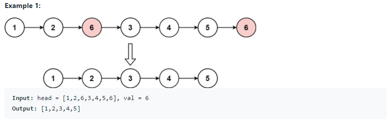
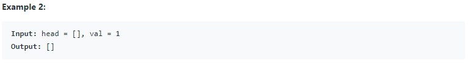
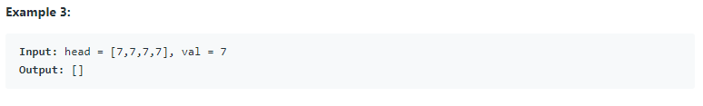
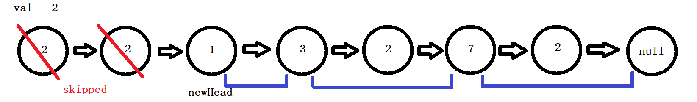

# 203. Remove Linked List Elements (<span style="color:limegreen">Easy</span>):

## Question Description:








---
## My solution:

In this question, we should consider 3 cases:

1. **Case 0 (Base Case):** if `head` is `null`, just return `head`.
2. **Case 1:** if the starting nodes' value matches `val`, we have to skip.
   * Using a `while` loop, we check if `head.val = val`, if so we skip to `head.next` until there is no leading `val` node.
   * Then do steps in **Case 2**
3. **Case 2:** if the starting node's value is not `val`
   * Initialize `newHead` to current `head` node. This is used for returning.
   * Using a `while` loop, we check if `head.next.val` equals to `val`, if so, we skip `head.next` by setting `head.next = head.next.next`.
   * If not, then move head to the next node.
   * Until head reaches the end of list, return `newHead`.



```java
public ListNode removeElements(ListNode head, int val) {
    if (head == null){
        return head;
    }
    
    while (head != null){
        if (head.val != val){
            break;
        }
        head = head.next;
    }
    
    ListNode newHead = head;
    
    while (head != null && head.next != null){
        if (head.next.val == val){
            head.next = head.next.next;
        }else{
            head = head.next;
        }
    }
    
    return newHead;
}
```

---
## Efficiency Analysis:
>Runtime: <font size=4>**O(n)**</font>, our solution only loops once from start to end of the LinkedList
>
>Memory: <font size=4>**O(1)**</font>, our solution did not use any additional data structure to store data.