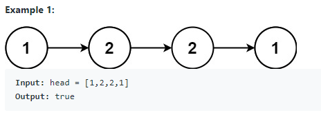
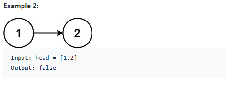
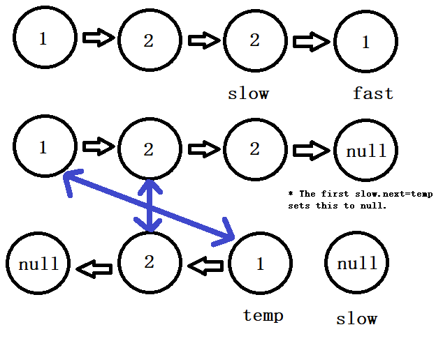

# 234. Palindrome Linked List (Easy):

## Question Description:






---
## My solution:

We can solve this by reversing the second half of the LinkedList, and compare the two halves.

First, we use the <font size=4>**Fast-Slow Pointers**</font> to get to the middle of the list. (With **Fast** pointer moving 2 steps and **Slow** pointer moving 1 step each time, when the **Fast** pointer reaches the end of the list, **Slow** will be in the middle).

Then, we reverse the second half of the list (from **Slow** to end of list).

Lastly, we compare the two halves and return corresponding value.

**Note:** For **Linked List Reversing** algorithm, see [Q141](141.%20Linked%20List%20Cycle.md).



```java
public boolean isPalindrome(ListNode head) {
    ListNode slow = head;
    ListNode fast = head;
    
    while(fast != null && fast.next != null){
        slow = slow.next;
        fast = fast.next.next;
    }
    
    // Reverse second half
    ListNode temp = null;
    while(slow != null){
        ListNode tempNext = slow.next;
        slow.next = temp;
        temp = slow;
        slow = tempNext;
    }
    
    while (head != null && temp != null){
        if (head.val != temp.val){
            return false;
        }
        head = head.next;
        temp = temp.next;
    }
    
    return true;
}
```

---
## Efficiency Analysis:
>Runtime: <font size=4>**O(n)**</font>, our solution took n/2 steps to get <font size=4>**slow**</font> pointer to the middle, took n/2 steps to reverse the second half, and took n/2 steps to compare the two halves. In total, it is O(3n/2). That is O(n) in general.
>
>Memory: <font size=4>**O(1)**</font>, our solution did not use any additional data structure to store data.