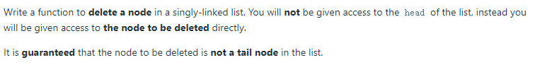

# 237. Delete Node in a Linked List (<span style="color:limegreen">Easy</span>):

## Question Description:



---
## My solution:

According to the question, we are given the node to be deleted. So we cannot do normal skipping of the node.

The node is guarantee to not be the tail, so we can just copy the value of the next node to the current node and skip the next node.

```java
public void deleteNode(ListNode node) {
    node.val = node.next.val;
    node.next = node.next.next;
}
```

---
## Efficiency Analysis:
>Runtime: <font size=4>**O(1)**</font>, we are only doing one operation.
>
>Memory: <font size=4>**O(1)**</font>, our solution did not use any additional data structure to store data.