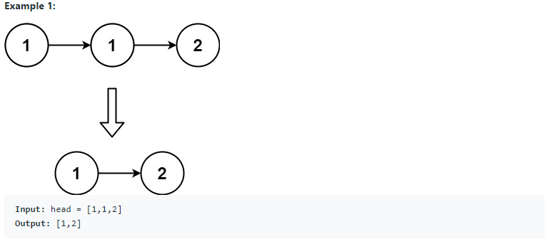

# 83. Remove Duplicates from Sorted List (<span style="color:limegreen">Easy</span>):

## Question Description:





---
## My solution:

Base case: Check if LinkList is `null`

First, we check if the next node value is equal to the current node value. If so, we skip the next node by relinking `head.next = head.next.next`. If not, we simply move the `head` node to its next.

**Note:** Because we are moving the `head` node, we should have a new `ListNode` to record the initial `head` node, as we need to return that.


```java
public ListNode deleteDuplicates(ListNode head) {
    if(head == null){
        return head;   
    }
    ListNode res = head;
    while(head != null && head.next != null){
        if(head.val == head.next.val){
            head.next = head.next.next;
        }else{
            head = head.next;
        }
    }
    return res;
}
```

---
## Efficiency Analysis:
>Runtime: <font size=4>**O(n)**</font>, our solution only loops once from starting node to ending node.
>
>Memory: <font size=4>**O(1)**</font>, our solution did not use any data structure to store data.