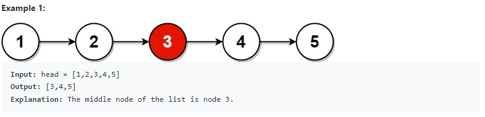
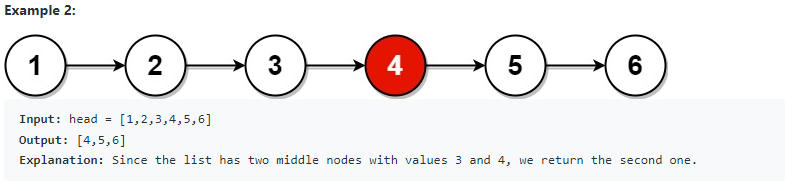
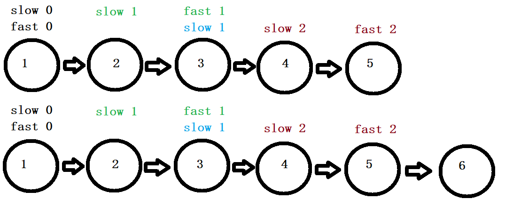

# 876. Middle of the Linked List (<span style="color:limegreen">Easy</span>):

## Question Description:






---
## My solution:

This question is the best illustration of the `Fast-Slow Pointer` algorithm.

We have two nodes pointing to head at the beggining. In the `while` loop, `slow` moves 1 step and `fast` moves 2 steps each time, until `fast` reaches the end of the LinkedList. After the loop, `slow` will be the middle node.



```java
public ListNode middleNode(ListNode head) {
    ListNode slow = head;
    ListNode fast = head;
    
    while(fast != null && fast.next != null){
        slow = slow.next;
        fast = fast.next.next;
    }
    
    return slow;
}
```

---
## Efficiency Analysis:
>Runtime: <font size=4>**O(n)**</font>, our solution takes n/2 steps for `fast` to reach the end. Therefore, in general, O(n).
>
>Memory: <font size=4>**O(1)**</font>, our solution did not use any additional data structure to store data.