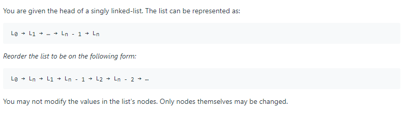
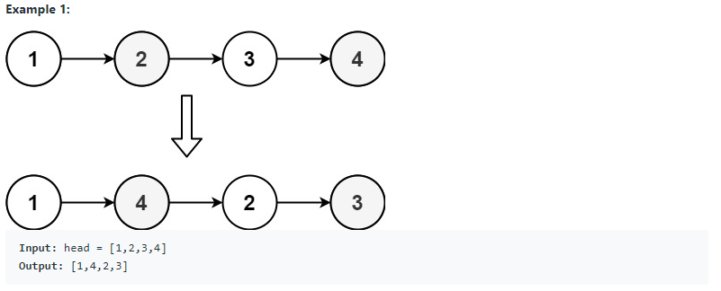
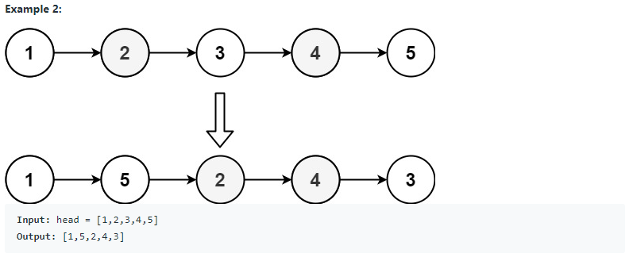
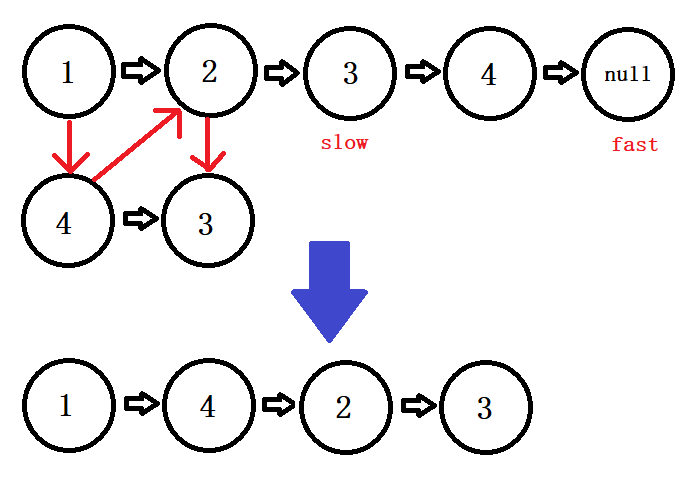

# 143. Reorder List (<span style="color:orange">Medium</span>):

## Question Description:






---
## My solution:

We need 3 steps to solve this problem.

1. Get to the middle of the LinkedList.
   * We do it by using <font size=4>**Fast-Slow Pointers**</font> algorithm.
2. Reverse the second half.
   * We do it by using the [Reverse Linked List](LinkedList/Singly%20Linked%20List/Easy/206.%20Reverse%20Linked%20List) algorithm.
3. Merge the two halves.
   * The two halves here are: (`head` to `slow`(the middle node)) and (`reversed` to `slow`)
   * My merging logic:
     * Have a variable recording the steps. Each **even** step links ``head``'s next value to the current ``reversed``. Each **odd** step links ``head``'s next value to ``tempHeadNext``(the original first half).
   * A better merging logic is listed below.



```java
public void reorderList(ListNode head) {
    ListNode slow = head;
    ListNode fast = head;
    
    // Get to middle node
    while (fast != null && fast.next != null){
        slow = slow.next;
        fast = fast.next.next;
    }
    
    // Reverse second half
    ListNode reversed = null;
    while (slow != null){
        ListNode tempSlowNext = slow.next;
        slow.next = reversed;
        reversed = slow;
        slow = tempSlowNext;
    }
    
    // Merge the two halves
    int step = 0;
    ListNode tempHeadNext = head.next;
    while (tempHeadNext != null && reversed != null){
        if (step % 2 == 0){
            head.next = reversed;
            reversed = reversed.next;
        }else{
            head.next = tempHeadNext;
            tempHeadNext = tempHeadNext.next;
        }
        head = head.next;
        step++;
    }
}
```

<h3> A better merging from LeetCode Discussion</h3>

<font size=4>This improved the runtime in LeetCode submission:</font>

> 2ms -> 1ms
> 
> 72.68% -> 99.97%

```java
// From: https://leetcode.com/problems/reorder-list/discuss/1494229/java-100
private void merge(ListNode a, ListNode b) {        
    while (b != null && a != null) {
        ListNode temp1 = a.next;
        a.next = b;
        
        ListNode temp2 = b.next;
        b.next = temp1;
        
        a = temp1;
        b = temp2;
    }
    if (a != null) a.next = null;
}
```

---
## Efficiency Analysis:
>Runtime: <font size=4>**O(n)**</font>, our solution took n/2 steps to get <font size=4>**slow**</font> pointer to the middle, took n/2 steps to reverse the second half, and took n/2 steps to merge the two halves. In total, it is O(3n/2). That is, O(n) in general.
>
>Memory: <font size=4>**O(1)**</font>, our solution did not use any additional data structure to store data.