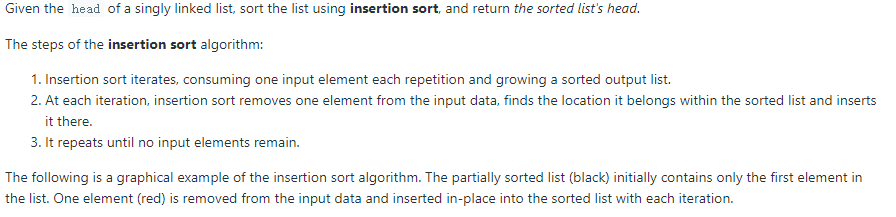
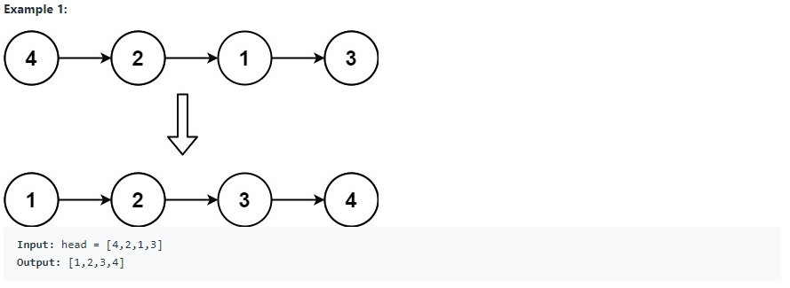
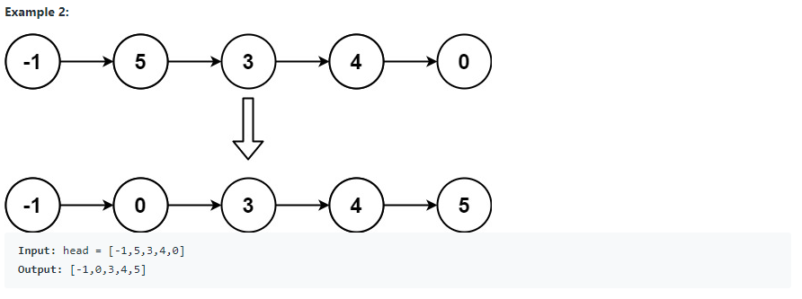
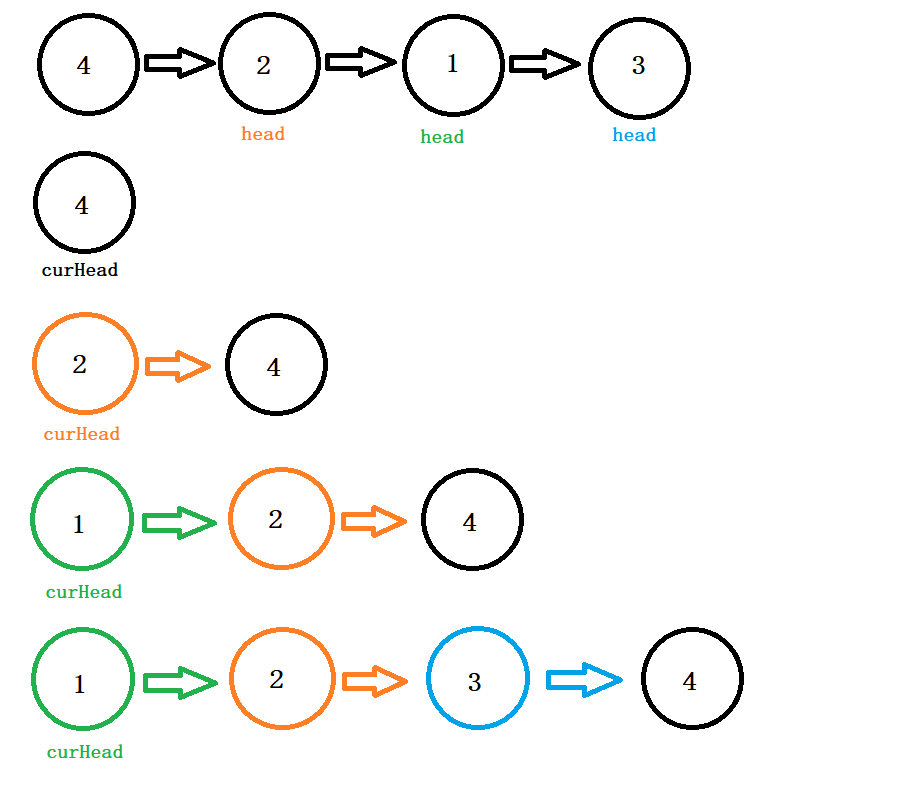

# QuestionName (<span style="color:orange">Medium</span>):

## Question Description:






---
## My solution:

The solution is just a modified version of `Insertion Sort` for LinkedList. 

The logic is as follow:
1. Check the base case: If the list is empty or only contains only one node, just return `head`.
2. Initialize a new node `curHead` to a size-1 list with value `head.val`, and move `head` to its next place for later iteration.
3. Iterate the list from the second node of the list, and have a inner loop to through the sorted list so far with the following considerations:
   -  Every time of the loop we are having a "pre-node", and comparing node.next with the current value. (Note that when we want to modify a node's linking, we often do that from the previous node.)
   -  If the current value(`head.val`) is less than the compared node, we insert `head` in between.
   -  If the `head.val` is larger than all nodes in the sorted list, we add it to the last place.
4. After the inner loop, move `head` to its next to continue the iteration, and assign `curHead` to `dummyHead.next`.

**Note:** We use a `dummyHead` to do the comparison in the inner loop to prevent unwanted changes to the previous sorted list `curHead`. Each time we finish the inner loop, `dummyHead.next` will be the new sorted list so far. (Explanation for step 4).



```java
public ListNode insertionSortList(ListNode head) {
    if (head == null || head.next == null){
        return head;
    }
    ListNode curHead = new ListNode(head.val);
    head = head.next;
    int size = 1;
    ListNode dummyHead;
    ListNode tempHead;
    while (head != null){
        dummyHead  = new ListNode(0,curHead);
        tempHead = dummyHead;
        for (int i = 0; i < size; i++){
            if (tempHead.next != null && head.val <= tempHead.next.val){
                tempHead.next = new ListNode(head.val,tempHead.next);
                break;
            } else if (i == size - 1){
                tempHead.next.next = new ListNode(head.val);
                break;
            }
            tempHead = tempHead.next;
        }
        curHead = dummyHead.next;
        size++;
        head = head.next;
    }
    return curHead;
}
```

---
## Efficiency Analysis:
>Runtime: <font size=4>**O(n<sup>2</sup>)**</font>. In the worse case, every node have to compare `n` times, and there are `n` nodes in the List. Therefore, the time complexity is **O(n<sup>2</sup>)**.
>
>Memory: <font size=4>**O(1)**</font>, our solution did not use any additional data structure to store data.