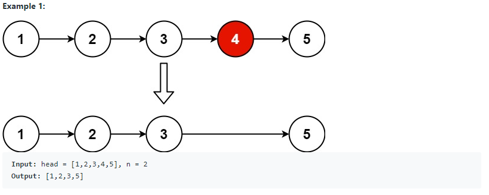
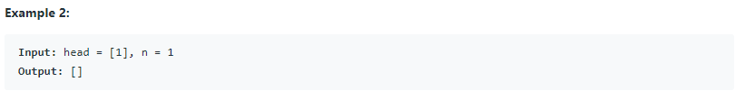
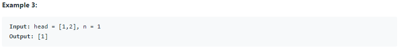
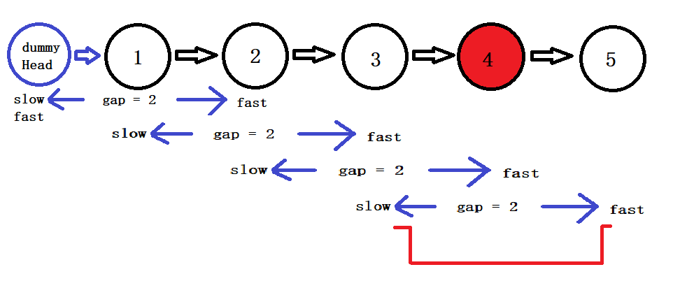

# QuestionName (<span style="color:orange">Medium</span>):

## Question Description:








---
## My solution:

To remove the `n`th from the end, we can let `slow` and `fast` pointers have a `gap` by moving `fast` to `n` nodes further. Then, moves `slow` and `fast` one step each time untit `fast` reaches the end. At that point, `slow` will be in one node before the targeted node. Then we just delete the next node.



```java
public ListNode removeNthFromEnd(ListNode head, int n) {
    ListNode dummyHead = new ListNode(0,head);
    ListNode slow = dummyHead;
    ListNode fast = dummyHead;
    
    int gap = 0;
    while (gap != n){
        fast = fast.next;
        gap++;
    }
    
    while (fast.next != null){
        slow = slow.next;
        fast = fast.next;
    }
    
    slow.next = slow.next.next;
    
    return dummyHead.next;
}
```

---
## Efficiency Analysis:
>Runtime: <font size=4>**O(n)**</font>, our solution is a one pass. It only go through the list once.
>
>Memory: <font size=4>**O(1)**</font>, our solution did not use any additional data structure to store data.