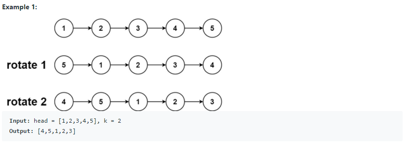
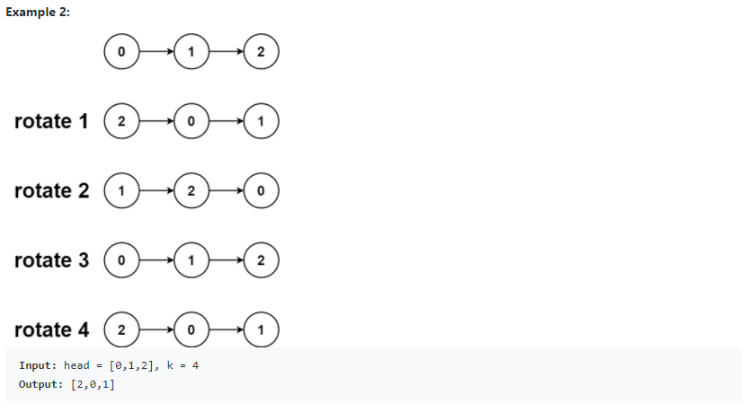
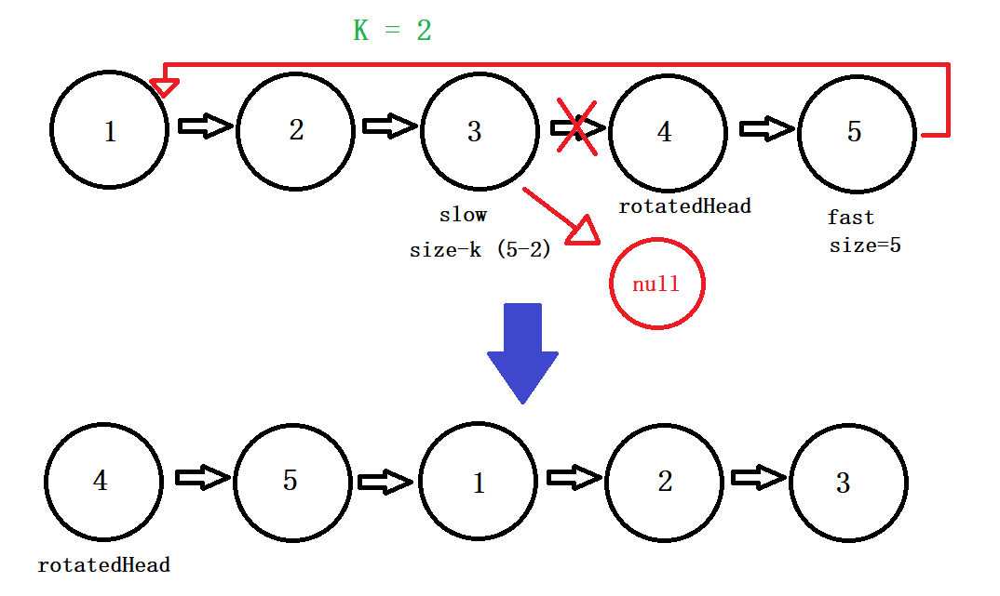

# 61. Rotate List (<span style="color:orange">Medium</span>):

## Question Description:






---
## My solution:

This problem is straightforward. We need to get to the **k**th place, make that `node` the head of the LinkedList and make **k-1**th place link to null.

There are 3 cases we have to consider:
1. Base case:
   * When the LinkedList is empty or only has one `node`, just return the original list.
2. Common case: 
   * First, we go through the LinkedList to get the `size`.
   * Then, we move `slow` to the `(size-k)`th node, and assign `rotatedHead` to `slow.next` (the `(size-k+1)`th node). Then make `slow.next = null`. 
   * Last, link `fast`(original tail) to `head`(original head), and return `rotatedHead`.
   * **Note**: 
     * `(size-k)`th node will be the tail of the rotated List, and `(size-k+1)`th node will be the head of the rotated List.
     * When `k` is larger than `size`, we must reduce it to smaller than `size`. We do that by `k % size`. (For example, for size=3, rotating the 8th place = rotating the 2nd place.)
3. Extreme case:
   * When `k` or `k`'s multiple is equal to `0` or `size`, just return the original list, because there is no rotation.
   



```java
public ListNode rotateRight(ListNode head, int k) {
    if (head == null || head.next == null){
        return head;
    }
    
    ListNode fast = head;
    int size = 1;
    while (fast.next != null){
        size++;
        fast = fast.next;
    }
    k %= size;
    
    if (k == size || k == 0){
        return head;
    }
    
    ListNode slow = head;
    
    for (int i = 1; i < size - k; i++){
        slow = slow.next;
    }
    
    ListNode rotatedHead = slow.next;
    slow.next = null;
    fast.next = head;
    return rotatedHead;
}
```

---
## Efficiency Analysis:
>Runtime: <font size=4>**O(n)**</font>, our solution went through the list once to get the size (`n` operations). Then we move another `(n-k)` nodes to start rotation. That is `(2n-k)` operations. In general, it is **O(n)**.
>
>Memory: <font size=4>**O(1)**</font>, our solution did not use any additional data structure to store data.