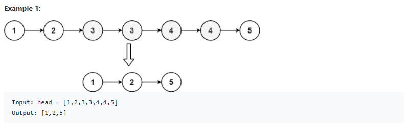
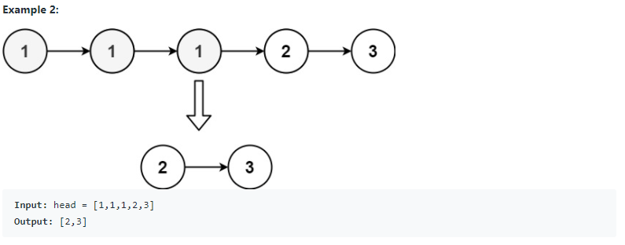
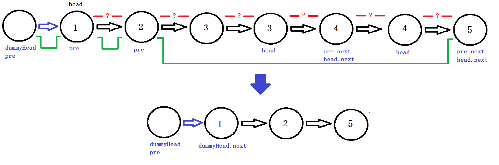

# 82. Remove Duplicates from Sorted List II (<span style="color:orange">Medium</span>):

## Question Description:






---
## Solution:

> Basic idea: 
>
> `pre` will keep recording each node that is unique, and skip all the duplicate nodes. 
>
> In the comparisons, if `head.val` and `head.next.val` are equal, the `head` will move until it is not equal with `head.next.val`. Note that up to this point, `head` is the last duplicate node of the comparison. Therefore, we should assign `head.next` to `pre.next`. 
>
> We repeat the process until a unique node, then we move `pre` to its next (This assure `pre` only store unique nodes).


1. First, we create a `dummyHead` node, and assign it to `pre`. The `pre` node will be the LinkedList to store non-duplicate nodes.
2. Loop through the list, each time compare current `head` with `head.next`.
   * If `head.next` does not exist, the loop will end.
   * If `head.next` exists, compare its `val` with `head.val`
     * If the values are the same, move `head` to its next until the comparison is `false`.
       * Till the comparison is `false`, `head` is in the last duplicate node for this series. Assign `head.next` to `pre.next`.
     * If the values are not the same, then move `pre` to its next.
3. Return `dummyHead.next`. 




```java
public ListNode deleteDuplicates(ListNode head) {
    ListNode dummyHead = new ListNode(0,head);
    ListNode pre = dummyHead;
    
    while (head != null){
        if (head.next != null && head.val == head.next.val){
            while (head.next != null && head.val == head.next.val){
                head = head.next;
            }
            pre.next = head.next;
        }else{
            pre = pre.next;
        }
        head = head.next;
    }
    
    return dummyHead.next;
}
```

---
## Efficiency Analysis:
>Runtime: <font size=4>**O(n)**</font>, since it's one pass along the input list.
>
>Memory: <font size=4>**O(1)**</font>, because we don't allocate any additional data structure.