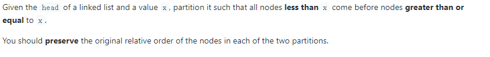
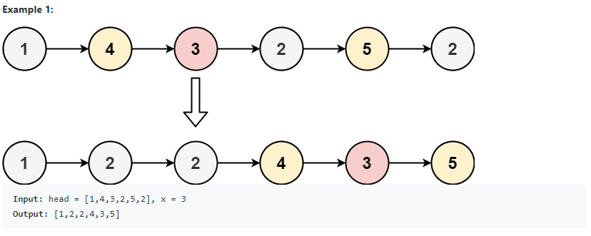
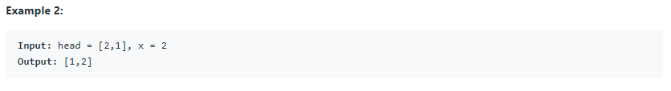
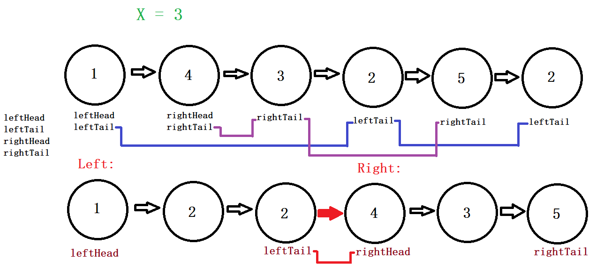

# 86. Partition List (<span style="color:orange">Medium</span>):

## Question Description:






---
## My solution:

From the problem description we know that we need to **preserve the original relative order**. So the basic idea is to have two parts(left,right), and linking the relative nodes based on the input `x`.

There are 3 cases we should consider:
1. Base case:
   * When the LinkedList is empty or has only 1 node, we should return the `head` immediately.
2. Common cases: (when there are some smaller and some larger)
   * Prepare 4 `ListNode`: `leftHead` (the first node less than `x`),`leftTail` (the current last node of left side),`rightHead` (the first node greater than `x`),`rightTail` (the current last node of right side).
   * Go through each node of the LinkedList
      - Assign `leftHead` to the first smaller than `x` node, and `rightHead` to the first greater than `x` node.
      - Keep linking `leftTail` and `rightTail` accordingly.
   * After the `while` loop, link `leftTail.next` to `rightHead`, and `rightTail.next` to `null`.
   * return `leftHead`
3.  Extreme cases: (when all nodes fall to one side)
    * Do case 2, except for the return value.
    * For the return value, consider the following:
      - If all nodes are greater than `x`: `leftHead` would be null. So return `rightHead`.
      - If all nodes are smaller than `x`: return `leftHead` as case 2, but add a condition to exclude `rightTail`'s linking as it will be `null`.



```java
public ListNode partition(ListNode head, int x) {
    if (head == null || head.next == null){
        return head;
    }
    
    ListNode tempHead = head;
    
    ListNode leftHead = null;
    ListNode leftTail = leftHead;
    ListNode rightHead = null;
    ListNode rightTail = rightHead;
    while (tempHead != null){
        if (tempHead.val < x){
            if (leftHead == null){
                leftHead = tempHead;
                leftTail = leftHead;
            }else{
                leftTail.next = tempHead;
                leftTail = leftTail.next;
            }
        }else{
            if (rightHead == null){
                rightHead = tempHead;
                rightTail = rightHead;
            }else{
                rightTail.next = tempHead;
                rightTail = rightTail.next;
            }
        }
        tempHead = tempHead.next;
    }
    
    if (leftHead == null){
        return rightHead;
    }else{
        leftTail.next = rightHead;
        if (rightHead != null){
            rightTail.next = null;
        }
        return leftHead;
    }
}
```

---
## Efficiency Analysis:
>Runtime: <font size=4>**O(n)**</font>, our solution is one pass. It goes through the LinkedList once.
>
>Memory: <font size=4>**O(1)**</font>, our solution did not use any additional data structure to store data.