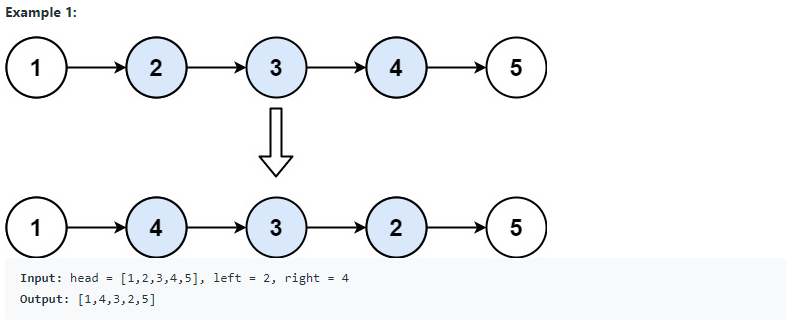
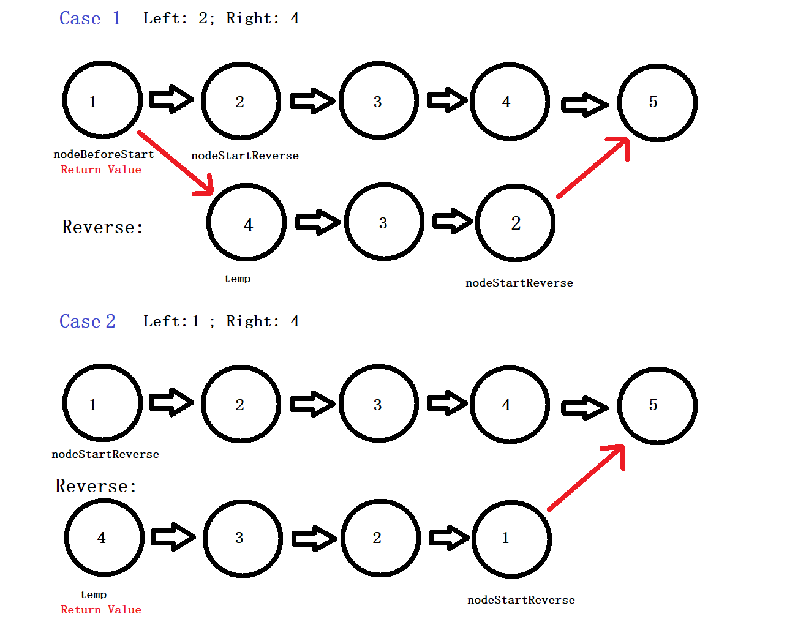

# 92. Reverse Linked List II (<span style="color:orange">Medium</span>):

## Question Description:





---
## My solution:

This question also uses the basic **[Reverse](LinkedList/Singly%20Linked%20List/Easy/206.%20Reverse%20Linked%20List)** algorithm, but with some detail consideration.

In this question, we should consider 3 cases:

1. **Case 0 (Base Case):** if **left** and **right** are the same, just return `head` because there are no changes.
2. **Case 1:** if **left = 1** (Reversing from the beginning)
   * Store the first node to `nodeStartReverse`. (After reversing, this variable will need to link to the **(right + 1)** node.)
   * Then reverse the required range of nodes.
   * Lastly, link `nodeStartReverse` to **(right + 1)** node, and return `temp`(the last reversed node). (Because we start reversing from the beginning, the last reversed node will be the head).
3. **Case 2:** if **left** is an index in between
   * First, initialize `res` to the `head` node. (This will be the return value, as the reverse does not start from the head.)
   * Then, we move the index to one previous **left**, and store that node to `nodeBeforeLeft`. (After reversing, this variable will need to link to the the last reversed node.)
   * Then move the index and the node to **left**, and record that node to `nodeStartReverse`. (After reversing, this variable will need to link to the **(right + 1)** node.)
   * Then reverse the required range of nodes.
   * Lastly, link `nodeStartReverse` to **(right + 1)** node, and link `nodeBeforeLeft` to `temp`(the last reversed node). Return `res`.



```java
public ListNode reverseBetween(ListNode head, int left, int right) {
    if (left == right){
        return head;
    }
    
    ListNode res = head;
    ListNode nodeBeforeLeft = null;
    int index = 1;
    
    if (left != 1){
        while (index != left - 1){
            head = head.next;
            index++;
        }
        nodeBeforeLeft = head;
        head = head.next;
        index++;
    }
    
    ListNode temp = null;
    ListNode nodeStartReverse = head;
    while (index <= right){
        ListNode tempNext = head.next;
        head.next = temp;
        temp = head;
        head = tempNext;
        index++;
    }
    
    nodeStartReverse.next = head;
    if (left == 1){
        return temp;
    }else{
        nodeBeforeLeft.next = temp;
        return res;
    }
}
```

---
## Efficiency Analysis:
>Runtime: <font size=4>**O(n)**</font>, our solution only goes throught the list once.
>
>Memory: <font size=4>**O(1)**</font>, our solution did not use any additional data structure to store data.